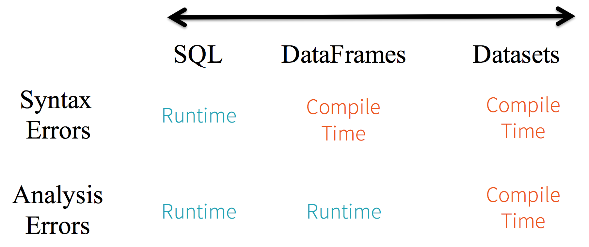

# Spark and data lakes

- [Spark and data lakes](#spark-and-data-lakes)
- [Intro](#intro)
- [Spark Essentials](#spark-essentials)

FYI: All exercises are available here: https://github.com/udacity/nd027-Data-Engineering-Data-Lakes-AWS-Exercises

# Intro

Big data ecosystem
- early effort: Hadoop ecoystem (from Apache), consisting of...
  - Hadoop Distributed File System (HDFS) = file storage system
  - MapReduce = parallel processing system
  - Hadoop YARN = resource manager for scheduling jobs
  - Apache Pig = SQL like language on top of MapReduce
  - Apache Hive = another SQL like interface on MapReduce
- next step: Apache Spark
- final step: lakehouse (wanting to combine strength)

Spark
- Spark often faster than Hadoop because keeps everything in memory (while Hadoop writes intermediate results to disk)
- Spark can work on HDFS but also sources (file systems, databases, streaming systems)
- Streaming: rather special (spark streaming, storm, flink)
- can be setup in 4 modes:
  - local mode (only one node)
  - Spark Standalone Customer Manager
  - Hadoop YARN
  - Open Source Manager from UC Berkley AMPLab
- Spark shell interacts with driver process to schedule task

When to use spark
- NOT when using small data
- NOT when having a relational database anyhow ?!
- NOT when streaming and latency < 500ms is important
- NOT when using deep learning (at least not natively)?!

Alternatives to Spark
- new databases: HBase, Cassandra
- distributed SQL engines: Impala, Presto

Data Lake
- PRO
  - supports structured, semi-structured and unstructured data
  - provides "schema-on-read" versus "schema-on-write"
  - have lower costs (?)
- CON
  - no atomic transactions
  - no quality enforcement
  - inconsistent data structures

Lakehouse
- key innovation: creation of metadata and governance layer
- also allows to incrementally improve data quality
  - bronze = raw data
  - silver = filtered, cleaned, augmented
  - gold = added business-level aggregate (star-schema)

# Spark Essentials

- important to write idempotent code (~functional, avoiding side effects)
- DO NOT read data into lists, instead use native APIs such as RDD
- spark uses lazy evaluation by default, creates DAG, optimizes it (using "Catalyst")
- spark treats data as immutable 

APIs
- Resilient Distributed Dataset (RDD)
  - =collection of elements
  - only one in beginning
  - rather low-level
  - useful if data is unstructured
- DataFrame
  - = table with named columns (but no types?! not sure...)
  - higher level
  - introduces tables with columns!
- Datasets
  - = collection of strongly typed JVM objects (Java VM)
  - most restrictive
  - adds additional compile checks
- image.png
  

PySpark
- SparkContext - connects to cluster
- SparkSession
- Exercise 
  - load a simple list of strings as RDD (`SparkContext.parallelize`)
  - `map` a function to it
  - `collect` results