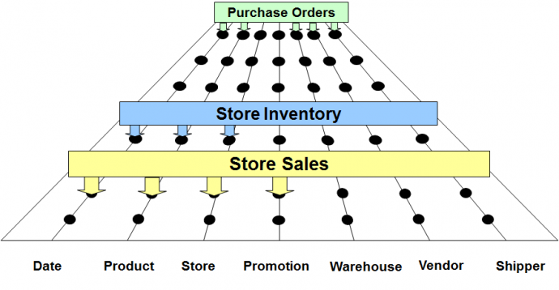
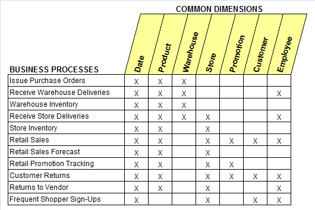
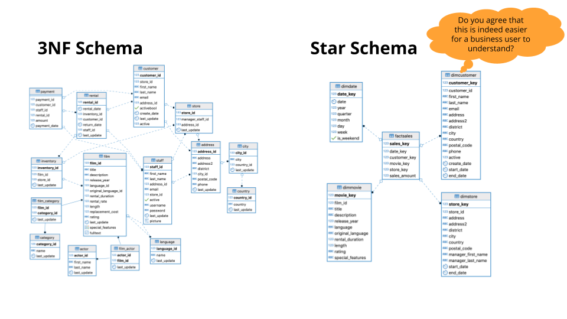
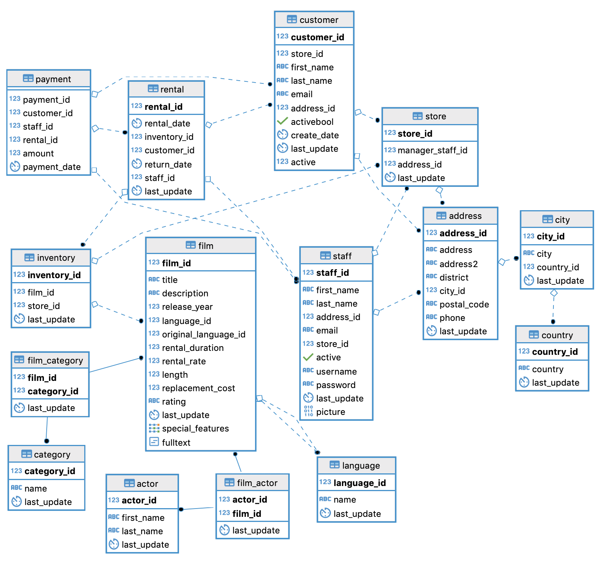
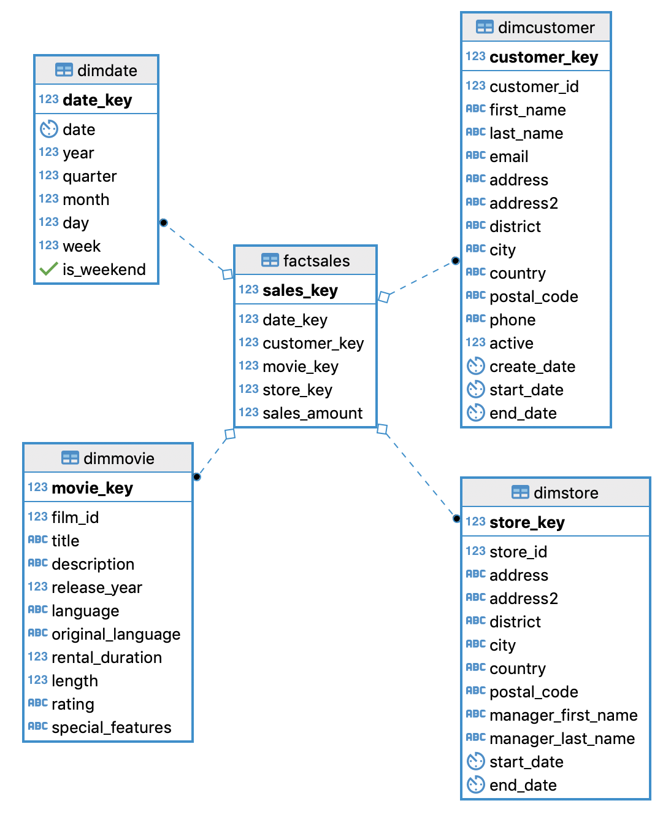
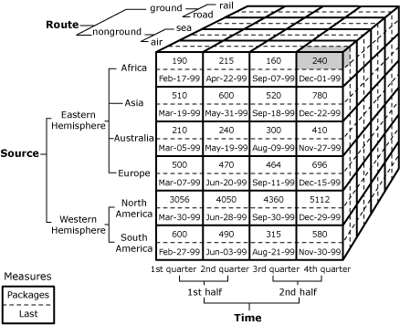
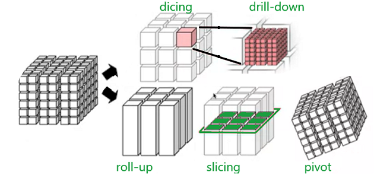
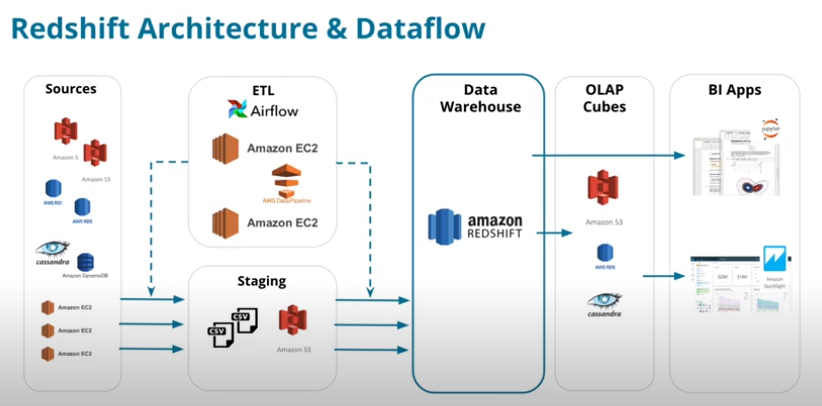
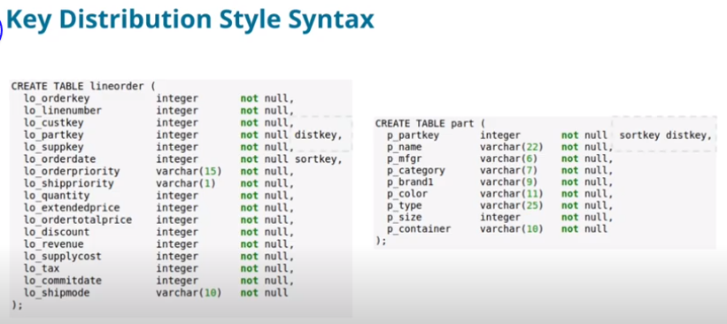

- [Intro Data Warehouse](#intro-data-warehouse)
  - [What's a data warehouse](#whats-a-data-warehouse)
  - [Dimension model review](#dimension-model-review)
  - [Exercise: PostgreSQL Sakila Transform 3NF to Star](#exercise-postgresql-sakila-transform-3nf-to-star)
  - [OLAP cube](#olap-cube)
  - [Conclusion](#conclusion)
- [Intro to Cloud Warehouses](#intro-to-cloud-warehouses)
- [AWS Redshift](#aws-redshift)
  - [Architecture](#architecture)
  - [ETL](#etl)
  - [Distribution styles](#distribution-styles)
  - [Conclusion](#conclusion-1)
- [Project](#project)
  - [steps](#steps)
  - [lessons learned](#lessons-learned)


# Intro Data Warehouse

- AWS
  - use regions `us-east-1` and `us-west-2`
  - have 25$ in total
  - use S3, Redshift boto3

## What's a data warehouse

- OLTP vs OLAP (transactional vs analytical)
  - OLAP usually much more denormalized
  - data warehouse targets OLAP
- Why not one database for both OLTP and OLAP?
  - if OLTP for analytics: slow queries, no complex queries
  - if OLAP for transactions: data duplication -> data integrity, no real-time updates

- data warehouse
  - = **copy** of transaction data for analysis purposes
  - retrieves and consolidates data periodically in batches
- often designed according *Kimball bus architecture* (~1990)
  - idea: share common dimension data model everywhere = central bus
    - dimensions = attributes of data (e.g. product, store, customer)
      - organized hierarchically, each level provides more detail
    - across dimensions are business processes (e.g. purchase order, store inventory, ...), which source from data marts (as client!)
    - departments are responsible for managing data marts
  - images from https://www.kimballgroup.com/data-warehouse-business-intelligence-resources/kimball-techniques/kimball-data-warehouse-bus-architecture/




## Dimension model review

- fact tables vs. dimension table
- 3NF vs star schema (latter one easier)



## Exercise: PostgreSQL Sakila Transform 3NF to Star

- database: sakila
  - https://dev.mysql.com/doc/sakila/en/
  - postgres version: https://github.com/devrimgunduz/pagila
- using sql in jupyter notebook
  - `%load_ext sql`
  - `%sql` for single line (and `$` for python var access)
    - example: `nStores = %sql select count(*) from $store;`
  - `%%sql` for multi line (no python var access?)
- EDA: check...
  - table size
  - value ranges
  - ...
- transform 3NF schema to star schema (see below)
  - fact table: `factSales` 
  - dim tables: dimMovie, dimCustomer, dimStore, dimDate
  - process
    - a lot of information is simply dropped (e.g. actors in movie, payment, inventory, ...)
    - some tables are denormalized (address-table moved into customer, store)
    - date table new (previously an actual date column)
  - ETL process




- Lessons learned
  - data types
    - `SERIAL`=auto-incrementing integer column
    - `smallint`=int16
    - `date`=only date, 4 bytes
    - `timestamp`=datetime with microsecond precision, 8 bytes
    - `year`..

```sql
CREATE TABLE dimCustomer
(
  customer_key SERIAL PRIMARY KEY,  -- usual type for first col
  customer_id  smallint NOT NULL,
  create_date  timestamp NOT NULL,
  start_date   date NOT NULL,
);
```

```sql
-- typical SQl ETL query  
INSERT INTO test_table (date, revenue)
SELECT payment_date AS date,
       amount AS revenue
FROM payment;
```

## OLAP cube

- can be easily constructed from star schema
- aggregates fact table across e.g. 2 dimensions
- supports operations
  - drill-down = reduce aggregation from e.g. year to month
  - roll-up = opposite of drill-down (more aggregation)
  - slice = select data subset from single dim
  - dice = select data subset from multiple dim
  - cut = remove data subset
  - pivot = rotate cube view from e.g sales-by-product for different region to sales-by-region for different products
  - drill-across = move from one cube to another
  - split / explode = break down single item to multiple ones (e.g. salecount-for-product to salecount-for-product-per-shop)






- Exercises
  - using usual `GROUPBY` command (see example query below)
    - Roll-up and drill-down
    - slicing and dicing
  - new commands
    - shortcut for several `GROUP BY`s and `UNION ALL`s:
      - `GROUP BY GROUPING SETS ((year,month), month)`
    - shortcut for several `GROUP BY GROUPING SETS`;
      - `GROUP BY CUBE` ->  (year, month), (year,NULL), (NULL, year)
      - `GROUP BY ROLLUP` -> (year, month), (year, NULL)

```sql
-- example dicing query
SELECT
  dimDate.day,
  dimMovie.rating,
  dimCustomer.city,
  sum(sales_amount) as revenue
FROM
  factSales
  JOIN dimDate
    on (dimDate.date_key = factSales.date_key)
  JOIN dimMovie     
    on (dimMovie.movie_key = factSales.movie_key)
  JOIN dimCustomer
    on (dimCustomer.customer_key = factSales.customer_key)
WHERE
  dimDate.day in ('1', '15', '30')
  AND dimMovie.rating in ('PG-13', 'PG')
  AND dimCustomer.city in ('Bellevue', 'Lancaster')
GROUP by
  (dimDate.day, dimMovie.rating, dimCustomer.city)
ORDER by
  revenue desc
LIMIT  20;
```

## Conclusion

- why we need OLTP AND OLAP
- dimensional modeling
- DWH architectures (Kimball..?)
- OLAP cube


# Intro to Cloud Warehouses

- ETL becomes ELT
  - data FIRST loaded into cloud warehouse and THEN transformed there
  - benefits
    - easy uploading of raw (large) data (to blob store or data lake)
    - only transform raw data as necessary (just in time)
    - more flexibility for unstructured (NoSQL) datasets
  - recommended article
    - https://learn.microsoft.com/en-us/azure/synapse-analytics/sql-data-warehouse/design-elt-data-loading

- Example NoSQL databases (including type)
  - Azure - CosmosDB
    - Gremlin - graph database
    - MongoDB - document
    - Cassandra - column oriented
  - GCP
    - Big Table - column oriented
    - Firestore - document
    - MongoDB Atlas - document
  - AWS
    - DynamoDB - Key value
    - DocumentDB - document
    - Keyspaces = column oriented
    - Neptune - graph
    - Time stream - time series

- Example ETL / ELT service providers
  - Cloud providers
    - Azure Data Factory
    - AWS Glue
    - GCP Dataflow
  - other providers
    - Informatica
    - Talend
    - Xplenty
    - Matillion
  - for streaming
    - Azure - Streaming Analytics
    - AWS - Kinesis
    - GCP - Dataflow

- Example Warehouses *systems* (combining storage, ETL/ELT, queries)
  - cloud providers
    - Azure Synapse
    - Amazon Redshift
    - GCP Big Query
  - = same thing as e.g. AWS RDS, but just for OLAP instead of OLTP
  - features
    - distributed, column storage optimized for OLAP
    - allows complex queries
    - integrates with several
      - data sources and file formats
      - data transformations
      - BI tools
    - also features security and compliance

# AWS Redshift

- Exercise: Setup Redshift
  - setup IAM, EC2 Security role, S3, Redshift, RDS
  - first via UI, then via boto3 SDK?
  - downsides of boto3 vs. Cloudformation/Terraform
    - imperative instead of desired declarative
    - doesn't support all resources
    - doesn't track state management
    - may increase code complexity

## Architecture

- Architecture of Redshift
  - leader node
    - faces client and optimizes queries
    - coordinates compute nodes
  - compute nodes
    - implemented via EC2 nodes
    - is divided into s lices
      - cluster with N slices can process N table partition parallely
      - each slice has dedicated CPU, storage and memory

## ETL

- ETL architecture
  - see diagram below
  - recommendation: always use staging area
    - = place for "transitory" tables during transformation
    - decouples direct connection between warehouse and sources
    - allows to decomplicate ETL step (by having intermediate steps)
    - helpful if source system changes (race conditions, etc.)
  - ETL process
    - transfer from S3 via `COPY` redshift SQL dialet
    - `COPY` is simply faster than `INSERT` every row individually
    - exercise shows that copying from partitioned CSV in parallel is faster (though exercises doesn't use staging area)



```sql
--- COPY to my_table in stage using Redshift SQL dialect
COPY mytable
FROM 's3://my-bucket/my-folder/'
IAM_ROLE 'my-redshift-role'
JSON 'auto'
STATUPDATE ON
MAXERROR 10
COMPUPDATE OFF
PARALLEL 4;


--- Alternatively use manifest file:
--- FROM 's3://my-bucket/my-manifest.manifest'
CREDENTIALS 'aws_iam_role=arn:aws:iam::123456789012:role/MyRedshiftRole'
DELIMITER ','
REGION 'us-west-2'
IGNOREHEADER 1;
```

```json
// Example manifest file
{
    "entries": [
        {
            "url": "s3://my-bucket/data-file1.csv",
            "mandatory": true,
            "meta": {
                "delimiter": ",",
                "quotechar": "\""
            }
        },
        {
            "url": "s3://my-bucket/data-file2.csv",
            "mandatory": true,
            "meta": {
                "delimiter": "|",
                "quotechar": "'"
            }
        }
    ]
}
```

```sql
--- Create Table in staging area
CREATE TABLE "sporting_event_ticket" (
    "id" double precision DEFAULT nextval('sporting_event_ticket_seq') NOT NULL,
    "sporting_event_id" double precision NOT NULL,
    ...
)
```


## Distribution styles

- `EVEN`
  - = rows are distributed along nodes in round-robin style
  - Problem: when JOINing e.g. fact and dim tables, many nodes need to talk to each other (a lot of "shuffling")
- `ALL` (or "broadcasting")
  - = small tables (dim tables) are replicated in every node
  - -> no shuffling
- `AUTO`
  - = let Redshift decide EVEN or ALL for each table separately
- `KEY`
  - = assign `distkey` to each node. Distribute rows accordingly

- How to set diststyles
  - for EVEN, ALL, AUTO - append `DISTSTYLE` to CREATE statement
  - for KEY: assign `distkey` dtype in both fact and dim table
    - sidenote: also use `sortkey` for columns often used in sorting

```sql
--- to create a table with diststyle `EVEN`
CREATE TABLE my_table (
    col1 INT,
    col2 VARCHAR(50)
)
DISTSTYLE EVEN;
```




## Conclusion

- Amazon Redshift Architecture
- How to ETL with Redshift
- How to ingest data into Redshift using S3 buckets
- Parallel ETL
- Optimizing Table Design using Distribution Styles

# Project

- Given
  - JSON data from "sparkify" in S3
    - user activity logs: s3://udacity-dend/log_data
      - activity metadata: s3://udacity-dend/log_json_path.json
    - song metadata: s3://udacity-dend/song_data
  - star schema database
    - fact table:
      - songplays (songplay_id, start_time, user_id, level, song_id, artist_id, session_id, location, user_agent)
    - dim tables:
      - users: user_id, first_name, last_name, gender, level
      - songs: song_id, title, artist_id, year, duration
      - artists: artist_id, name, location, lattitude, longitude
      - time: start_time, hour, day, week, month, year, weekday
- Do
  - ETL into `song_data` table in staging area
  - ETL to sparkify star schema database
- Tips
  - AWS IAC
    - PROB: setting up correct roles, rights, regions, etc
      - use IAC boto3 code
    - PROB: time limit of each AWS session provided by udacity
      - use own account?!
  - template
    - `create_table.py` to create tables for star schema
    - `etl.py` for loading from S3 to staging table and then to star
    - `sql_queries.py` - queries for being imported
    - `README.md` - discussion on process and decisions


## steps

- IAC
- [x] setup S3, EC2, etc. using boto3 example account
- [x] setup Redshift database
- NOTE for myself: Used IAC solution notebook from exercise

- Create Table Schemas
- [x] Design schemas for your fact and dimension tables
- [x] Write a SQL CREATE statement for each of these tables in sql_queries.py
- [x] Complete the logic in create_tables.py to connect to the database and create these tables
- [x] Write SQL DROP statements to drop tables in the beginning of create_tables.py if the tables already exist. This way, you can run create_tables.py whenever you want to reset your database and test your ETL pipeline.
- [x] Launch a redshift cluster and create an IAM role that has read access to S3.
- [x] Add redshift database and IAM role info to dwh.cfg.
- [x] Test by running create_tables.py and checking the table schemas in your redshift database. You can use Query Editor in the AWS Redshift console for this.

- Build ETL Pipeline
- [x] Implement the logic in etl.py to load data from S3 to staging tables on Redshift.
- [x] Implement the logic in etl.py to load data from staging tables to analytics tables on Redshift.
- [x] Test by running etl.py after running create_tables.py and running the analytic queries on your Redshift database to compare your results with the expected results.
- [ ] Delete your redshift cluster when finished.

- Documentation
- [x] Discuss the purpose of this database in context of the startup, Sparkify, and their analytical goals.
- [x] State and justify your database schema design and ETL pipeline.

## lessons learned

- redshift hierarchy
  - cluster = collection of compute nodes and associated resources
  - database = collection of tables, views and other database objects
  - table = ...
- redshift cluster query editor
  - didn't use it at all because current user doesn't have rights to create connection, but sounds helpful