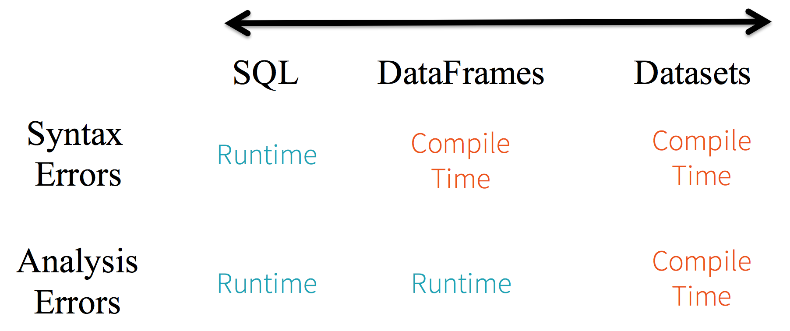
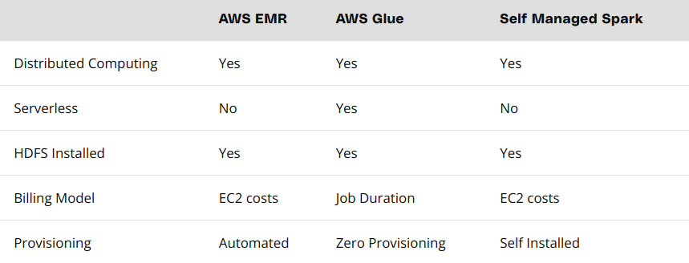
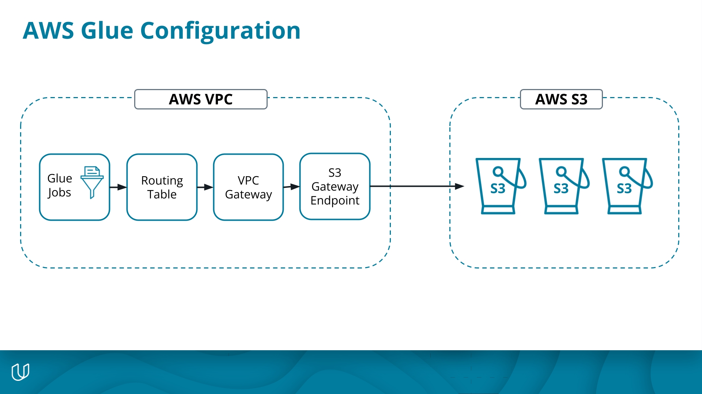

# Spark and data lakes

- [Spark and data lakes](#spark-and-data-lakes)
- [Intro](#intro)
- [Spark Essentials](#spark-essentials)
- [Using Spark in AWS](#using-spark-in-aws)
- [Lakehouse architecture](#lakehouse-architecture)
- [Project STEDI Step Trainer](#project-stedi-step-trainer)
  - [Rubrik](#rubrik)
  - [Data](#data)
  - [TODO internal](#todo-internal)
  - [Lessons learned](#lessons-learned)

FYI: All exercises are available here: https://github.com/udacity/nd027-Data-Engineering-Data-Lakes-AWS-Exercises

# Intro

Big data ecosystem
- early effort: Hadoop ecoystem (from Apache), consisting of...
  - Hadoop Distributed File System (HDFS) = file storage system
  - MapReduce = parallel processing system
  - Hadoop YARN = resource manager for scheduling jobs
  - Apache Pig = SQL like language on top of MapReduce
  - Apache Hive = another SQL like interface on MapReduce
- next step: Apache Spark
- final step: lakehouse (wanting to combine strength)

Spark
- Spark often faster than Hadoop because keeps everything in memory (while Hadoop writes intermediate results to disk)
- Spark can work on HDFS but also sources (file systems, databases, streaming systems)
- Streaming: rather special (spark streaming, storm, flink)
- can be setup in 4 modes:
  - local mode (only one node)
  - Spark Standalone Customer Manager
  - Hadoop YARN
  - Open Source Manager from UC Berkley AMPLab
- Spark shell interacts with driver process to schedule task

When to use spark
- NOT when using small data
- NOT when having a relational database anyhow ?!
- NOT when streaming and latency < 500ms is important
- NOT when using deep learning (at least not natively)?!

Alternatives to Spark
- new databases: HBase, Cassandra
- distributed SQL engines: Impala, Presto

Data Lake
- PRO
  - supports structured, semi-structured and unstructured data
  - provides "schema-on-read" versus "schema-on-write"
  - have lower costs (?)
- CON
  - no atomic transactions
  - no quality enforcement
  - inconsistent data structures

Lakehouse
- key innovation: creation of metadata and governance layer
- also allows to incrementally improve data quality
  - bronze = raw data
  - silver = filtered, cleaned, augmented
  - gold = added business-level aggregate (star-schema)


# Spark Essentials

- important to write idempotent code (~functional, avoiding side effects)
- DO NOT read data into lists, instead use native APIs such as RDD
- spark uses lazy evaluation by default, creates DAG, optimizes it (using "Catalyst")
- spark treats data as immutable 

APIs
- Resilient Distributed Dataset (RDD)
  - =collection of elements
  - only one in beginning
  - rather low-level
  - useful if data is unstructured
- DataFrame
  - = table with named columns (but no types?! not sure...)
  - higher level
  - introduces tables with columns!
- Datasets
  - = collection of strongly typed JVM objects (Java VM)
  - most restrictive
  - adds additional compile checks
- image.png
  


PySpark
- SparkContext - connects to cluster
- SparkSession
- Exercise 
  - load a simple list of strings as **RDD** (`SparkContext.parallelize`)
  - `map` a function to it
  - `collect` results

Filesystem
- Spark may use HDFS files
- such files may be replicated
- and stored in blob storage

Exercise Spark DataFrames
- `df=spark.read.json(path)`
- `df.write.save(out_path, format='csv')`
- other relevant methods
  - info
    - printSchema()
    - describe()
  - general
    - select
    - take = head
    - filter = where
    - sort
    - dropDuplicates
    - withColumn - adds/updates column
  - aggregate
    - groupBy
    - agg({"salary": "avg", "age": "max"})
    - count
    - countDistinct
    - avg,max,min
  - window functions
    - partitionBy
    - rangeBetween
    - rowsBetween
  - udf
    - see below

```python
get_hour = udf(lambda x: datetime.datetime.fromtimestamp(x / 1000.0). hour)
user_log = user_log.withColumn("hour", get_hour(user_log.ts))
```

SparkSQL
- is declarative approach (contrasting with procedural above)
- example below

```python
spark.sql('''
          SELECT userID, firstname, page, song
          FROM user_log_table 
          WHERE userID == '1046'
          '''
          ).collect()
```

# Using Spark in AWS

- There are several options to run Spark in AWS
  - AWS EMR = Elastic MapReduce
    - supports Apache Spark, Hadoop, Hive and Prestor
  - EC2 (would need to install Spark on each machine)
  - Glue
    - needs some setup since S3 runs in different network?!
    - Exercise: Use mostly CLI to create Glue and required services




- choosing storage system
  - here: S3 for simplicity and costs
  - better: HDFS
    - HDFS replicates and is thus fault-tolerant
    - therefore, Spark often installed on top of Hadoop(?)
    - HDFS requires strict fileformat: parquet or avro

- Glue Jobs
  - scheduled jobs
  - can be created as python files and uploaded
  - can be created via drag/drop in Glue Studio consisting of
    - source (S3, glue table, databases)
    - transform
    - target
  - Exercise in GlueStudio: run once
    - source=`aws s3 cp ./project/starter/customer/customer-1655563258079.json s3://_______/customer/landing/`
    - transform = filter `shareWithResearch!=0`
    - destination = `.../customer/trusted`
    - export as python script, see
      - https://github.com/udacity/nd027-Data-Engineering-Data-Lakes-AWS-Exercises/tree/main/lesson-3-using-spark-in-aws/exercises/concept3-creating-a-job-using-glue-studio/solution

# Lakehouse architecture

- recommendations 
  - uses several zones
    - landing zone (raw)
    - trusted zone (validated, maybe cleaned)
    - curated (e.g. joining daa)
  - use compression (gzip) to reduce S3 costs
  - store in columnar format e.g. parquet

AWS Glue Data Catalog (used to stored metadata)
- open source alternatives
  - Apache Hive Metastore (built on Hadoop) 
    - primarily designed for Apache Hive data warehouse
  - Apache Atlas
    - more unified for various platforms
  - Apache Range
    - more security focused, provides access control
  - Alation (paid)
  - Collibra (paid)
- cloud alternatives
  - AWS Glue Data Catalog
  - AWS Lake Formation - offers more than cataloging
  - Azure Purview
  - Azure Data Catalog

Glue tables
- like pointer to original table (only structured data)
- plus metadata (schema)
- can be used like a symlink to access data
- can be defined in various ways
  - Glue console = UI (defining each field)
  - Glue job can generate table definition automatically
  - SQL using Data Definition Language (DDL) or CREATE
- once setup, can use AWS Athena
  - serverless SQL query tool
  - designed to query data in S3 (JSON, Parquet, ORC, etc.)
- *Exercise: Created landing zone*
  - copy into landing zone `aws s3 cp ./project/starter/accelerometer/ \ s3://_______/accelerometer/landing/ --recursive`
  - create Glue table using Glue Console
  - Run Athena (What is happening here?!)
  - save query output as `*_landing.sql`

Data Privacy
- recommendation: use opt-in flag for each customer (whether data usage allowed)
- Problem: Often secondary data recorded in different tables (website clicks, chat history, etc.)
  - Solution: JOIN secondary data with customeTable to check allowance
  - *Exercise: create trusted zone*
  - JOIN accelerometer node with customer node
  - DROP some rows
  - save output in trusted zone

Streaming
- Spark Streaming for near real-time data receiving
- possible message brokers
  - Kafka
  - AWS SQS (Simple Queue Service)
  - Amazon Kinesis
- Glue can load data directly from Kafka and Kinesis
- Alternatively, Kafka (+x?) can store directly in S3

Curated data
- *Exercise: Curated data*
  - Clone previous job for trusted zone
  - add `DropFields` transform dropping accelormeter fields (?!)

# Project STEDI Step Trainer

## Rubrik

- https://review.udacity.com/#!/rubrics/4883/view
- Landing Zone
  - [ ] ingest data from S3 using Glue Studio
    - customer_landing_to_trusted.py
    - accelerometer_landing_to_trusted_zone.py 
  - [ ] create Glue table manually using SQL DDL scripts
    - customer_landing.sql
    - accelerometer_landing.sql
  - [ ] query landing zone using Athena. Take screenshots!
    - customer_landing.png
    - accelerometer_landing.png
- Trusted Zone
  - [ ] configure glue studio to dynamically (?) update glue table schema from JSON data
    - Glue Job Python code shows that the option to dynamically infer and update schema is enabled?!
  - [ ] query trusted tables using Athena
    - take screenshot
  - [ ] inner JOIN privacy table via glue job   
    - customer_landing_to_trusted.py
    - accelerometer_landing_to_trusted_zone.py 
  - [ ] DROP rows where sharedWithResearchAsOfDate==None
    - customer_landing_to_trusted.py
    - accelerometer_landing_to_trusted_zone.py 
- Curated Zone
  - [ ] create customers_curated
    - Only keep customers with accelerometer data and share aggreement
    - take screenshot cusomter_trusted.png
  - [ ] Sanitize step_trainer_trusted
    - read from S3
    - only keep records from curated customers (see above)
  - [ ] create machine_learning curated
    - JOIN step_trainer_trusted and trusted_accelormeter on timestamp
    - only keep customers who have agree to share data

## Data

Three JSON files
- customer records
- step trainer records
- accelormeter records

## TODO internal

- [ ] setup infrastructure
  - could do manually, but would highly prefer Terraform
  - Glue ecosysem
    - there
- [ ] copy stuff to S3 (AW CLI)
- [ ] copy into landing zone via Glue Studio Job


## Lessons learned

Glue ecoystem
- glue job
  - serverless data processing service
  - requires an IAM role for e.g. S3 access
- glue crawler
  - = automated data discover service for glue data catalog
  - infers schemas and creates metadata tables
- glue connection 
  - defines connection to (usually external?) data source
- glue registry
  - stores and versions schemas and transformations
  - provides additional functionality to glue data catalog
- glue studio 
  - visual interface for building and running glue ETL jobs

Why VPC endpoint, route table, etc. is necessary
- to enable private connection between S3 bucket and AWS Glue
- S3 bucket itself resides in no VPC!
- VPC endpoint
  - enables communication between private VPC and other AWS services
- route table
  - directs traffic to VPC endpoint