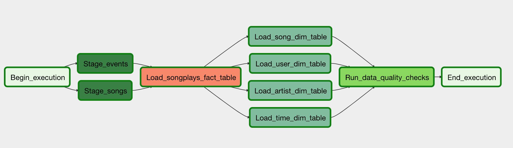

# Project: Data Pipelines with Airflow

Goal: Move JSON logs and metadata from S3 to Amazon Redshift



## Details

custom operators to perform tasks such as

- staging the data
- filling the data warehouse
- running checks on the data as the final step.

You'll be provided with a helpers class that contains all the SQL transformations. Thus, you won't need to write the ETL yourselves, but you'll need to execute it with your custom operators.

## How to setup environment

from lesson "Airflow and AWS"

- [x] `Create an IAM User in AWS`
- [x] Connect Airflow and AWS: `Connections - AWS Credentials`

```python
# Use S3 inside airflow
from airflow.hooks.S3_hook import S3Hook

hook = S3Hook(aws_conn_id='aws_credentials')
        bucket = Variable.get('s3_bucket')
        prefix = Variable.get('s3_prefix')
        logging.info(f"Listing Keys from {bucket}/{prefix}")
        keys = hook.list_keys(bucket, prefix=prefix)
        for key in keys:
            logging.info(f"- s3://{bucket}/{key}")
    list_keys()

list_keys_dag = list_keys()
```

- [x] `Configure Redshift Serverless`
- [x] `Add Airflow Connections to AWS Redshift`

- airflow

  - use the one provided by Udacity
  - OR use local airflow and [project template](https://s3.amazonaws.com/video.udacity-data.com/topher/2019/February/5c6058dc_project-template/project-template.zip) containing
    - DAG template with imports
    - operators
    - helper classes with SQL transformations

- cluster name is `default`
- database is `dev`

### check that redshift is accessible

- Guide on how to connect with redshift serverless
  - https://docs.aws.amazon.com/redshift/latest/mgmt/serverless-connecting.html
  - via a URL or
  - via redshift data API
    - https://github.com/aws-samples/getting-started-with-amazon-redshift-data-api#readme
- again with `psycopg2`

- [x] use Redshift query editor

```sql
-- Create the table
CREATE TABLE DummyTable (
    ID INT PRIMARY KEY,
    Name VARCHAR(50),
    Age INT
);

-- Insert data into the table
INSERT INTO DummyTable (ID, Name, Age) VALUES
    (1, 'John', 30),
    (2, 'Jane', 25),
    (3, 'Mike', 40);
```

- [x] using `aws redshift-data execute-statement` CLI from inside CloudShell
- [x] using `aws redshift-data execute-statement` CLI from local computer
- [x] using `psycopg2` from local computer

  - https://docs.aws.amazon.com/cli/latest/reference/redshift-data/execute-statement.html
  - https://docs.aws.amazon.com/redshift-data/latest/APIReference/API_ExecuteStatement.html

```bash
# somehow does NOT work?!
aws redshift-data execute-statement --endpoint-url https://default.561130499334.eu-central-1.redshift-serverless.amazonaws.com --database dev --sql 'SELECT * FROM DummyTable' --cli-read-timeout 10 --cli-connect-timeout 10

# works
aws redshift-data execute-statement --workgroup-name default --database dev --sql "SELECT * FROM DummyTable"
```

Lesson learned

- only can make Redshift serverless workgroup publicly accessible if subnets are configured correctly! (either public or private with NAT). However, there will be no error!
- Templates to setup VPC and public/private subnets
  - Cloudformation templates
    - https://aws.amazon.com/cloudformation/resources/templates/
  - Cloudformation template with two public and two private subnets
    - https://docs.aws.amazon.com/codebuild/latest/userguide/cloudformation-vpc-template.html
  - Other templates
    - https://gist.github.com/lizrice/5889f33511aab739d873cb622688317e
    - https://gist.github.com/jbesw/f9401b4c52a7446ef1bb71ceea8cc3e8

## Instructions

### Start airflow

- [x] start airflow in workspace (tried this but really tedious, rather setup locally)

```bash
# check if already running
ps aux | grep airflow

# to start Postgres and Cassandra
source /opt/airflow/start-services.sh

# to start airflow
source /opt/airflow/start.sh

# to connect
cd /home/workspaces
chmod +x set_connections_and_variables.sh
source ./set_connections_and_variables.sh

# add admin user
airflow users create --email student@example.com --firstname aStudent --lastname aStudent --password admin --role Admin --username admin

# check again
ps aux | grep airflow
```

- [x] start local airflow
- [x] trigger example DAG
  - write PY file
  - test PY file via `python my_dag.py`
  - copy file to `$AIRFLOW_HOME/dags` (or change folder in `$AIRFLOW_HOME/airflow.cfg`)
  - `airflow dags list`
  - trigger DAG e.g. manually or via CLI `airflow dags trigger`

```bash
# from https://airflow.apache.org/docs/docker-stack/entrypoint.html#entrypoint-commands
docker run -it -p 8080:8080 -v "/mnt/sda1":"/mnt/sda1" --name airflow apache/airflow:2.3.2 bash

# later on:
docker start airflow

# attach to container OR start multiplexer
bash <(curl -L zellij.dev/launch)

# add admin user (see above)
airflow users create --email student@example.com --firstname aStudent --lastname aStudent --password admin --role Admin --username admin

# start webserver
airflow webserver

# start airflow scheduler
airflow scheduler

# Open ~/airflow/airflow.cfg and change DAG and plugin folder to
/home/workspace/udacity_data_engineer/4_pipelines/project/template/dags
/home/workspace/udacity_data_engineer/4_pipelines/project/template/plugins
```

### Copy data to own S3 bucket

- [x] copy to own S3 bucket
  - Log data: s3://udacity-dend/log_data
  - Song data: s3://udacity-dend/song_data

```bash
MY_S3_BUCKET="udacity-dataengineer-pipeline-project-s3"
DIRNAME="log_data"
DIRNAME="song_data"  #song-data contains many more dirs (B/...)
aws s3 cp s3://udacity-dend/${DIRNAME}/ ~/${DIRNAME}/ --recursive
aws s3 cp ~/${DIRNAME}/ s3://${MY_S3_BUCKET}/${DIRNAME}/ --recursive
aws s3 ls s3://${MY_S3_BUCKET}/${DIRNAME}/
```

- [x] add default parameters according to these guidelines

  - The DAG does not have dependencies on past runs
  - On failure, the task are retried 3 timess
  - Retries happen every 5 minutes
  - Catchup is turned off
  - Do not email on retry

- [x] configure task dependencies s.t. below


### Check if plugin with 4 custom operators and helper file is loaded

- [x] Import DAG with plugin successfully

- write plugin (already done in template)
- check in UI: `Admin` -> `Plugins` should list some plugins
- restart scheduler and webserver!
  - `airflow webserver -D` # Stop webserver
  - `airflow scheduler -D` # Stop scheduler

## Fill in custom operators

### Stage Operator

- [x] build Stage operator

- inputs
  - s3-path
  - target table
- output
  - `staging_events` and `staging_songs`
- methods
  - > Another important requirement of the stage operator is containing a templated field that allows it to load timestamped files from S3 based on the execution time and run backfills.
  - creates and runs SQL statement
  - for both songs and events
    - creates table ? not sure if necessary
    - loads JSON from S3 to Redshift staging table
- NOTES
  - song_data
    - has 15k files
    - independent of timestamp
  - log_data / event_data
    - has 30 files and 8056 records
    - from 2018-11-01 to 2018-11-30 (including)
  - schedule
    - not yet super clear how to get
  - to get logs from redshift query editor `SELECT * FROM sys_load_error_detail LIMIT 10;`
  - relevant hooks / operators
    - `RedShiftHook` and `RedshiftSQLOperator`
      - https://airflow.apache.org/docs/apache-airflow-providers-amazon/2.4.0/operators/redshift.html
      - also offers `.copy_from_s3` method
      - might offer additional optimizations over `PostGresHook`
      - uses `redshift_default` as default
    - `PostGresHook`
    - `S3ToRedshiftOperator`
      - https://airflow.apache.org/docs/apache-airflow-providers-amazon/1.0.0/operators/s3_to_redshift.html
  - differences operators and hooks
    - operator = task template
    - hook = helper class
- NEXT STEPS
  - create jupyter notebook with psycopg2 and all necessary SQL statements (including loading by day?!)
  - afterwards, simply move everything to airflow DAGs and `PostgresHook`

```python
# OPERATOR
    setup__task_create_table = RedshiftSQLOperator(
        task_id='setup__create_table',
        sql="""
            CREATE TABLE IF NOT EXISTS fruit (
            fruit_id INTEGER,
            name VARCHAR NOT NULL,
            color VARCHAR NOT NULL
            );
        """,
    )
```

### Fact and Dimension Operator

- [x] build Fact and Dimension operator
  - inputs
    - SQL statement
    - source table name
    - target table name
    - insert_mode = {overwrite (truncate-insert), append}
      - **overwrite** for dimension tables
      - **append** for fact tables (because so long)

### Data quality Operator

- [x] build Data Quality operator
  - inputs
    - SQL test statement
    - expected test result

## FAQs

Missing time table schema

```sql
CREATE TABLE public.time (
    start_time timestamp NOT NULL,
    hour int4 NOT NULL,
    day int4 NOT NULL,
    week int4 NOT NULL,
    month int4 NOT NULL,
    year int4 NOT NULL,
    dayofweek int4 NOT NULL,
);
```

Staging should be scheduled hourly ?!

Load into staging

> You need to use the /log_json_path.json file to specify the format of the json file for the log data (and use the 'auto' setting for song data)

## Lessons learned

- Redshift built on PostgreSQL variant

## Solutions from other students

- https://github.com/Lal4Tech/Data-Engineering-With-AWS/tree/main/4_Automate_Data_Pipelines/project
