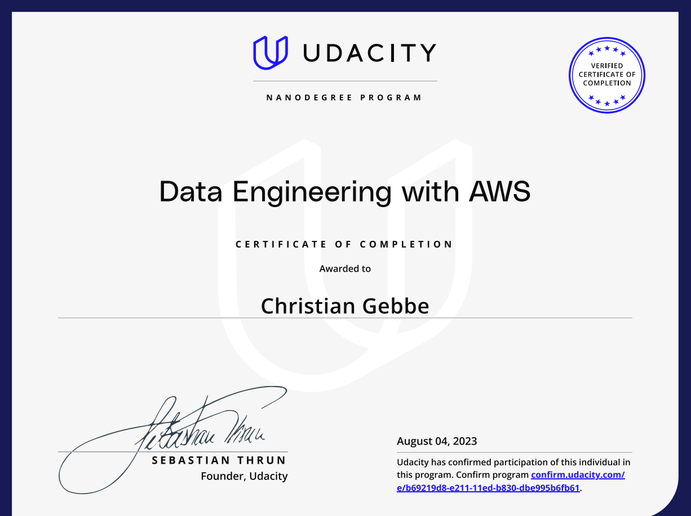

# About

My notes and projects for the [udacity data engineering nanodegree](https://www.udacity.com/course/data-engineer-nanodegree--nd027).

1. Data Modeling
2. Data Warehouses
3. Data Lakes
4. Data Pipelines

# Certificate

